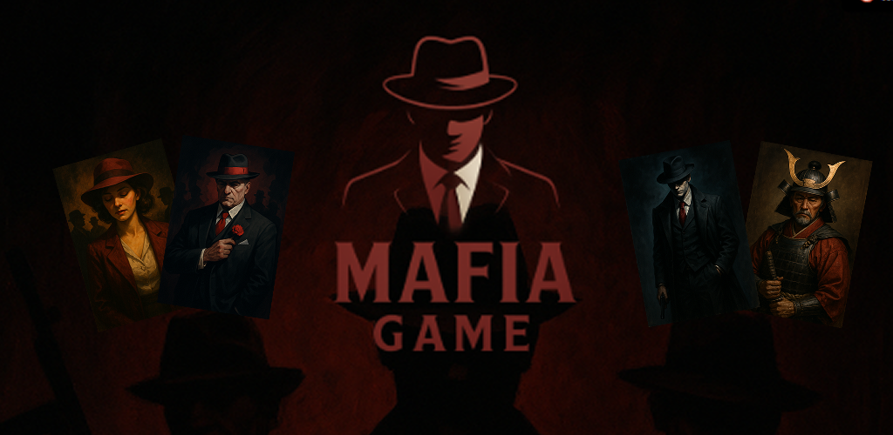

# Mafia-Card-Game-By-OZ

Download Mafia: [Mafia Card Game By OZ](https://drive.google.com/file/d/14zUlxjywa3t2fqo0Ao3h2XKn5c4MnIMn/view?usp=sharing)

Description:

Mafia Card Game by OZ brings the classic party game Mafia to your phone! Gather your friends, assign secret roles, and dive into a world of strategy, deduction, and suspense. Whether you’re at a party, family gathering, or game night, this app makes it easy to play Mafia anywhere—no cards or moderator needed!

Features:

Classic Mafia Gameplay: Experience the beloved social deduction game where players are secretly assigned roles as Mafia, Townsfolk, and special characters. Use your wits to uncover the Mafia before they eliminate everyone else!
Multiple Roles: Play with a variety of roles including Mafia, Don, Detective, Doctor, Maniac, Yakuza, Shogun, and more. Each role brings unique abilities and strategies to the game.
Flexible Game Modes: Choose between Narrator Mode (with a human moderator) or Automation Mode (let the app guide the game for you).
Role Assignment Options: Assign roles automatically for quick setup, or use manual assignment for custom games.
Easy Player Management: Add, remove, and manage players with a simple interface. The app keeps track of all roles and actions.
Customizable Rules: Adjust the number of special roles and game settings to fit your group size and preferences.
Modern, User-Friendly Design: Enjoy a clean, intuitive interface optimized for both small and large screens.
No Account Required: Jump right into the game—no sign-up or login needed.
How to Play:

Gather Players: Add your friends to the player list (minimum 5 players recommended).
Choose Game & Role Modes: Select between Standard or Japanese mode, and choose automatic or manual role assignment.
Assign Roles: The app will assign roles secretly to each player, or let you assign them manually.
Game Flow: The game alternates between night and day phases. At night, Mafia and other special roles act in secret. During the day, players discuss and vote to eliminate suspects.
Win Conditions: The Town wins by eliminating all Mafia and threats. The Mafia wins by outnumbering the Town. Special roles may have unique objectives!
Roles Included:

Mafia: Work together to eliminate the Town.
Don: The leader of the Mafia, often with special powers.
Detective: Investigate players to uncover their true roles.
Doctor: Protect players from elimination each night.
Maniac: A wildcard with their own win condition.
Yakuza & Shogun: Special roles for Japanese mode, adding new twists to the game.
Right Hand: A unique Mafia assistant role, chosen during the game.
Game Modes:

Narrator Mode: A human moderator guides the game, perfect for traditional play.
Automation Mode: The app automates the game flow, making it easy for everyone to play.
Why Choose Mafia Card Game by OZ?

Perfect for parties, family gatherings, or online play with friends.
No need for physical cards or complicated setup.
Supports both classic and custom Mafia experiences.
Regular updates and improvements based on player feedback.
Note:
Mafia Card Game by OZ does not collect any personal data. The app is designed for group play and does not require an internet connection after installation.

Contact & Support:
Have questions or suggestions? Contact us at ozgroupdevelopers@gmail.com.

Download now and bring the excitement of Mafia to your next game night!
